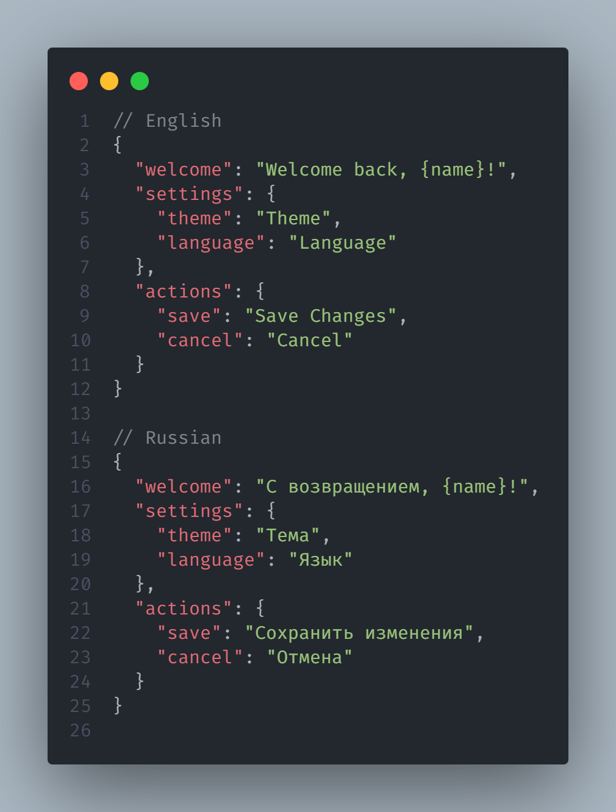

# Polyglot Keeper

AI-powered internationalization synchronization tool that automatically translates missing keys and maintains perfect structural consistency across all locale files.

Works with any framework (React, Vue, Svelte, Angular, etc.) and any i18n library (react-i18next, vue-i18n, svelte-i18n, etc.).

|               Before                |               After               |
| :---------------------------------: | :-------------------------------: |
|  |  |

## Features

- **AI Translation** — Automatically translates missing keys using Google Gemini, OpenAI, or Anthropic Claude
- **Universal Framework Support** — Works with any project structure via JSON configuration
- **Structure Mirroring** — Ensures all locale files match the exact key order of your primary locale
- **Obsolete Key Removal** — Cleans up keys that no longer exist in the primary locale
- **Batch Processing** — Handles large translation sets efficiently with retry logic
- **Interactive Setup** — Guided configuration wizard for first-time setup

## Installation

```bash
npm install -D polyglot-keeper
```

## Quick Start

### 1. Initialize Configuration

```bash
npx polyglot-keeper init
```

This creates:

- `polyglot.config.json` — Your configuration
- `.env` — API key placeholder (add your key here)
- `.env.example` — API key template
- Locales directory

`init` only prepares the project. To translate, run `npx polyglot-keeper sync` when you're ready.

### 2. Add Your API Key

```bash
# Edit .env and add your API key
POLYGLOT_API_KEY=your_api_key_here
```

Get your API key from:

- [Google AI Studio](https://aistudio.google.com/app/apikey) (Gemini)
- [OpenAI Platform](https://platform.openai.com/api-keys) (OpenAI)
- [Anthropic Console](https://console.anthropic.com/settings/keys) (Claude)

### 3. Create Base Locale File

Create your primary locale file (for example `en.json` if you use `localeFormat: "short"`):

```json
{
  "common": {
    "welcome": "Welcome",
    "save": "Save"
  },
  "auth": {
    "login": "Log In"
  }
}
```

### 4. Add Script to package.json

```json
{
  "scripts": {
    "translate": "npx polyglot-keeper sync"
  }
}
```

### 5. Sync Translations

```bash
npm run translate
```

Or directly:

```bash
npx polyglot-keeper sync
```

## Configuration

### Configuration File (polyglot.config.json)

```json
{
  "provider": "gemini",
  "model": "gemini-2.5-flash",
  "localeFormat": "short",
  "locales": ["en", "ru", "es"],
  "defaultLocale": "en",
  "localesDir": "src/i18n",
  "envFile": ".env",
  "envVarName": "POLYGLOT_API_KEY",
  "batchSize": 200,
  "batchDelay": 2000,
  "retryDelay": 35000,
  "maxRetries": 3
}
```

### Options

| Option          | Type                                  | Default              | Description                            |
| --------------- | ------------------------------------- | -------------------- | -------------------------------------- |
| `provider`      | `"gemini" \| "openai" \| "anthropic"` | `"gemini"`           | AI provider                            |
| `model`         | `string`                              | provider-dependent   | Model name for the selected provider   |
| `localeFormat`  | `"short" \| "pair"`                   | `"short"`            | File naming: `en.json` or `en-US.json` |
| `locales`       | `string[]`                            | —                    | All supported locales                  |
| `defaultLocale` | `string`                              | —                    | Primary locale (source of truth)       |
| `localesDir`    | `string`                              | `"src/i18n"`         | Path to locales directory              |
| `envFile`       | `string`                              | `".env"`             | Environment file name                  |
| `envVarName`    | `string`                              | `"POLYGLOT_API_KEY"` | API key variable name                  |
| `batchSize`     | `number`                              | `200`                | Keys per batch                         |
| `batchDelay`    | `number`                              | `2000`               | Delay between batches (ms)             |
| `retryDelay`    | `number`                              | `35000`              | Delay on rate limit (ms)               |
| `maxRetries`    | `number`                              | `3`                  | Retry attempts                         |

### Locale Formats

- **`short`** — Simple locale codes: `en.json`, `ru.json`, `es.json`
- **`pair`** — BCP 47 format: `en-US.json`, `ru-RU.json`, `es-ES.json`

## CLI Commands

```bash
# Initialize configuration (interactive wizard)
npx polyglot-keeper init
npx polyglot-keeper --setup

# Sync translations
npx polyglot-keeper sync

# Run with specific root directory
npx polyglot-keeper sync --root ./my-project
```

## How It Works

1. **Translation** — Finds missing keys in target locales and translates via AI
2. **Cleanup** — Removes obsolete keys that don't exist in the primary locale
3. **Reordering** — Restructures all files to match the primary locale's key order

## Example Output

```
🌍 Translation Synchronization Tool
━━━━━━━━━━━━━━━━━━━━━━━━━━━━━━━━━━━━━━━━━━━━━━━━━━
📂 Loaded primary locale (en-US) with 128 keys
🎯 Target locales: ru-RU, es-ES

━━━ Processing ru-RU (ru-RU.json) ━━━
📦 Found 13 missing keys out of 128 total
📤 Batch 1/1 (13 keys)
✅ Translated 13 keys
💾 Saved ru-RU.json

━━━ Processing es-ES (es-ES.json) ━━━
✅ es-ES is up to date (128 keys)
💾 Saved es-ES.json

━━━━━━━━━━━━━━━━━━━━━━━━━━━━━━━━━━━━━━━━━━━━━━━━━━
📊 Summary:
  ru-RU: 13 translated
  es-ES: synchronized and sorted

✨ Completed in 4.42s
```

## Framework Examples

### React with react-i18next

```json
{
  "localesDir": "public/locales",
  "locales": ["en-US", "de-DE", "fr-FR"],
  "defaultLocale": "en-US",
  "localeFormat": "pair"
}
```

### Vue with vue-i18n

```json
{
  "localesDir": "src/i18n/locales",
  "locales": ["en-US", "ja-JP", "ko-KR"],
  "defaultLocale": "en-US",
  "localeFormat": "pair"
}
```

### Svelte with svelte-i18n

```json
{
  "localesDir": "src/lib/i18n",
  "locales": ["en-US", "es-ES", "pt-BR"],
  "defaultLocale": "en-US"
}
```

## Requirements

- Node.js 18+
- Google Gemini, OpenAI, or Anthropic API key

## License

MIT
