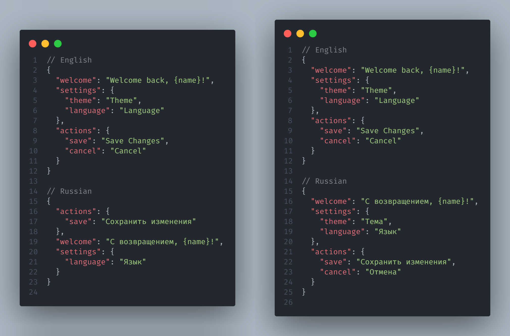
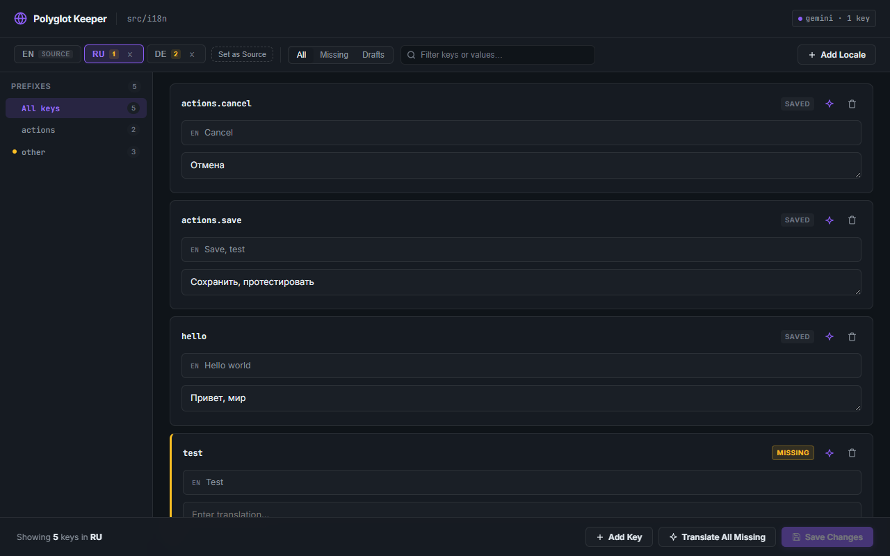

# Polyglot Keeper

🇺🇸 [English](README.md) | 🇷🇺 [Русский](docs/README_RU.md)

[](https://www.npmjs.com/package/polyglot-keeper)
[](https://www.npmjs.com/package/polyglot-keeper)
[](https://github.com/davidaganov/polyglot-keeper/blob/main/LICENSE)

**Polyglot Keeper** is an AI-powered i18n tool with two complementary modes:

- **CLI / Build-time** — sync your JSON locale files and Markdown content across all languages automatically.
- **Runtime API** — translate any string, array, or object structure on the fly, directly inside your app (Vue, React, Svelte, Astro, plain JS, Node.js, Edge Workers).

Works with any framework and any i18n library. No vendor lock-in.



---

## ✨ Features

- **AI Translation** — Gemini, OpenAI, or Anthropic. Your choice.
- **Runtime API** — Translate strings, arrays, and nested objects at runtime in any environment.
- **Proxy Mode** — Keep your API key server-side. Browser clients translate via your own endpoint with zero configuration overhead.
- **LRU Cache** — Repeated translations are instant and free (no extra API calls).
- **Visual Editor** — Built-in web UI (`npx polyglot-keeper serve`): translate keys with AI, add/remove locales, search, and save — all in the browser.
- **Change Tracking** — Detects source value changes and selectively retranslates (`off` / `on` / `carefully`).
- **Structure Mirroring** — Target locale files stay perfectly aligned with the source structure and key order.
- **Clean Up** — Automatically removes obsolete keys no longer present in the primary locale.
- **Markdown Support** — Translates entire `.md` files while preserving formatting.
- **Interactive Setup** — Guided CLI wizard. Up and running in under a minute.
- **AI Agent Skill** — Pre-packaged skill for AI coding assistants (Antigravity IDE, Cursor, Claude Code) to scaffold, integrate, and write idiomatic translation code.

---

## 🚀 Quick Start — CLI Mode

### 1. Install

```bash
npm install -D polyglot-keeper
```

### 2. Initialize

```bash
npx polyglot-keeper init
```

This creates `polyglot.config.json` and a `.env` file.

### 3. Add your API key(s)

```bash
# .env — supports multiple keys separated by commas for automatic rotation & rate-limit failover
POLYGLOT_API_KEY=key_1,key_2,key_3
```

### 4. Sync

```bash
npx polyglot-keeper sync        # JSON locale files
npx polyglot-keeper sync --md   # Markdown files
```

---

## 🖥 Visual Editor



Launch a local web UI for managing your locale files — no external service required.

```bash
npx polyglot-keeper serve
```

Opens `http://localhost:3636` in your browser automatically. Features:

- **Translation cards** — comfortable editing with source preview and draft tracking
- **Filter & Search** — filter by `All`, `Missing`, or `Drafts` (unsaved changes), with instant search
- **AI Translate** — translate a single key (✦) or all missing keys in bulk
- **Add / Delete & Source Switch** — add new locales or keys, delete with confirmation, and switch the primary source locale (`Set as Source`)
- **Save** — writes changes back to your JSON files on disk (<kbd>Ctrl+S</kbd> / <kbd>Cmd+S</kbd>)

Requires the same `polyglot.config.json` and `.env` (API keys) as the CLI.

---

## ⚡ Runtime API

Use `polyglot-keeper/runtime` to translate content inside your application at runtime — no build step required.

### Installation

The runtime is included with the package. No additional install needed.

### Initialization

Call `polyglot.init()` once in your app's entry point.

```ts
import { polyglot, API_PROVIDER } from "polyglot-keeper/runtime"

// Server-side / SSR (Direct Mode) — apiKey is safe here
polyglot.init({
  provider: API_PROVIDER.GEMINI,
  apiKey: process.env.GEMINI_API_KEY,
  defaultLocale: "en"
})

// Browser / SPA (Proxy Mode) — no apiKey in the bundle
polyglot.init({
  provider: API_PROVIDER.GEMINI,
  endpoint: "/api/translate" // your own server endpoint
})
```

### Translate a string

```ts
const text = await polyglot.t("Hello, world!", { to: "ru" })
// → "Привет, мир!"
```

### Translate an array

```ts
const tags = await polyglot.translate(["Technology", "Design", "Business"], { to: "de" })
// → ["Technologie", "Design", "Business"]
```

### Translate a nested object (preserves structure and TypeScript type)

```ts
const product = await polyglot.translate(
  {
    name: "Wireless Headphones",
    description: "Premium sound quality.",
    specs: { battery: "30 hours", weight: "250g" }
  },
  { to: "ru" }
)

// → { name: "Беспроводные наушники", description: "...", specs: { battery: "30 часов", weight: "250 г" } }
```

### Translate an entire locale file

```ts
import locale from "./i18n/en.json"

const ruLocale = await polyglot.translate(locale, { to: "ru" })
```

### Cache

Translations are cached in memory (LRU, 200 entries by default). The second call for the same input is instant.

```ts
// Force a fresh translation, bypassing the cache
await polyglot.t("Hello", { to: "ru", bypassCache: true })

// Clear the entire cache
polyglot.clearCache()
```

---

## 🔐 Proxy Mode (Browser / SPA)

In browser environments, your API key must never appear in the client bundle. Proxy Mode solves this: your client calls your own server endpoint, which holds the key and forwards the request to the AI provider.

### Server endpoint

Create a route on your server using `createTranslateHandler`. It returns a standard [Fetch API](https://developer.mozilla.org/en-US/docs/Web/API/Fetch_API) `Request → Response` handler, compatible with Astro, SvelteKit, Nuxt, Next.js App Router, Hono, Cloudflare Workers, and Express.

```ts
// src/pages/api/translate.ts — Astro API Route
import { createTranslateHandler, API_PROVIDER } from "polyglot-keeper/runtime"

export const POST = createTranslateHandler({
  keys: { [API_PROVIDER.GEMINI]: import.meta.env.GEMINI_API_KEY },
  allowedLocales: ["ru", "de", "zh", "fr"] // optional whitelist
})
```

```ts
// server/api/translate.post.ts — Nuxt server route
import { createTranslateHandler, API_PROVIDER } from "polyglot-keeper/runtime"

const handler = createTranslateHandler({
  keys: { [API_PROVIDER.GEMINI]: process.env.GEMINI_API_KEY! }
})

export default defineEventHandler((event) => handler(toWebRequest(event)))
```

### Client initialization

```ts
// main.ts
import { polyglot, API_PROVIDER } from "polyglot-keeper/runtime"

polyglot.init({
  provider: API_PROVIDER.GEMINI,
  endpoint: "/api/translate" // no apiKey!
})
```

### Vue component example

```vue
<script setup lang="ts">
import { ref, watchEffect } from "vue"
import { polyglot } from "polyglot-keeper/runtime"

const props = defineProps<{ text: string; locale: string }>()

const translated = ref(props.text)
const loading = ref(false)

const handleTranslate = async () => {
  loading.value = true
  try {
    translated.value = await polyglot.t(props.text, { to: props.locale })
  } finally {
    loading.value = false
  }
}

watchEffect(handleTranslate)
</script>

<template>
  <span :class="{ 'opacity-50': loading }">{{ translated }}</span>
</template>
```

---

## ⚙️ Configuration (CLI mode)

Your setup lives in `polyglot.config.json`.

<details>
<summary><b>Full configuration example</b></summary>

```json
{
  "envFile": ".env",
  "json": {
    "provider": "gemini",
    "model": "gemini-flash-latest",
    "envVarName": "POLYGLOT_API_KEY",
    "localeFormat": "short",
    "locales": ["EN", "RU"],
    "defaultLocale": "EN",
    "localesDir": "src/i18n",
    "trackChanges": "carefully",
    "batchSize": 200,
    "batchDelay": 2000,
    "retryDelay": 35000,
    "maxRetries": 3
  },
  "markdown": {
    "provider": "gemini",
    "model": "gemini-flash-latest",
    "envVarName": "POLYGLOT_MD_API_KEY",
    "contentDir": "content",
    "defaultLocale": "en",
    "locales": ["en", "ru"],
    "trackChanges": "carefully",
    "batchDelay": 2000,
    "retryDelay": 35000,
    "maxRetries": 3,
    "exclude": ["drafts/**", "private/**", "README.md"]
  }
}
```

</details>

### Locale formats

| Value   | Example filenames          |
| ------- | -------------------------- |
| `short` | `en.json`, `ru.json`       |
| `pair`  | `en-EN.json`, `ru-RU.json` |

### Change tracking modes

| Value         | Behavior                                                  |
| ------------- | --------------------------------------------------------- |
| `"off"`       | Default. Only translate missing keys.                     |
| `"on"`        | Auto-retranslate keys whose source value changed.         |
| `"carefully"` | Interactive per-key review: retranslate, skip, or freeze. |

> **Note:** Enabling tracking creates `.polyglot-lock.json`. A frozen key is permanently excluded from retranslation (useful for manual overrides). Use `sync --force` to unfreeze all keys.

### Markdown exclusions

```json
{
  "markdown": {
    "exclude": ["drafts/**", "private/**", "README.md", "**/*.draft.md"]
  }
}
```

---

## 💻 CLI Reference

| Command                            | Description                              |
| :--------------------------------- | :--------------------------------------- |
| `npx polyglot-keeper init`         | Start the interactive setup wizard       |
| `npx polyglot-keeper sync`         | Sync and translate JSON locale files     |
| `npx polyglot-keeper sync --md`    | Sync and translate Markdown files        |
| `npx polyglot-keeper sync --force` | Force retranslation of all existing keys |

---

## 📦 Import Reference

| Import path               | Contents                                                                               | Environment                          |
| ------------------------- | -------------------------------------------------------------------------------------- | ------------------------------------ |
| `polyglot-keeper`         | `run()`, `API_PROVIDER`, `TRACK_CHANGES`, `LOCALE_FORMAT`, config types                | Node.js only                         |
| `polyglot-keeper/runtime` | `polyglot`, `PolyglotRuntime`, `createTranslateHandler`, `API_PROVIDER`, runtime types | Universal (browser + Node.js + Edge) |

---

## 🤖 AI Agent Skill

Polyglot Keeper includes a pre-packaged **AI Skill** for coding assistants (Google Antigravity IDE, Cursor, Claude Code, GitHub Copilot, etc.) located in `skills/polyglot-keeper/`.

The skill equips your AI assistant with deep domain knowledge about Polyglot Keeper:

- Choosing between **Direct Mode** (backend/SSR) and **Proxy Mode** (client/SPA).
- Preventing AI API key leaks in client bundles.
- Setting up server handlers (`createTranslateHandler`) for Nuxt, Astro, Next.js, and Express.
- Type-safe object translations with `polyglot.translate()`.
- Best practices for caching, lifecycle initialization, and locale sync.

---

## 🛠 Requirements

- Node.js 20+
- An API key for [Google Gemini](https://aistudio.google.com/), [OpenAI](https://platform.openai.com/), or [Anthropic](https://www.anthropic.com/)

---

## 🤝 Contributing

```bash
git clone https://github.com/davidaganov/polyglot-keeper.git
cd polyglot-keeper
npm install

npm run lint
npm run typecheck
npm run test
npm run build
```

---

## 📄 License

MIT © [David Aganov](https://aganov.dev/en)
