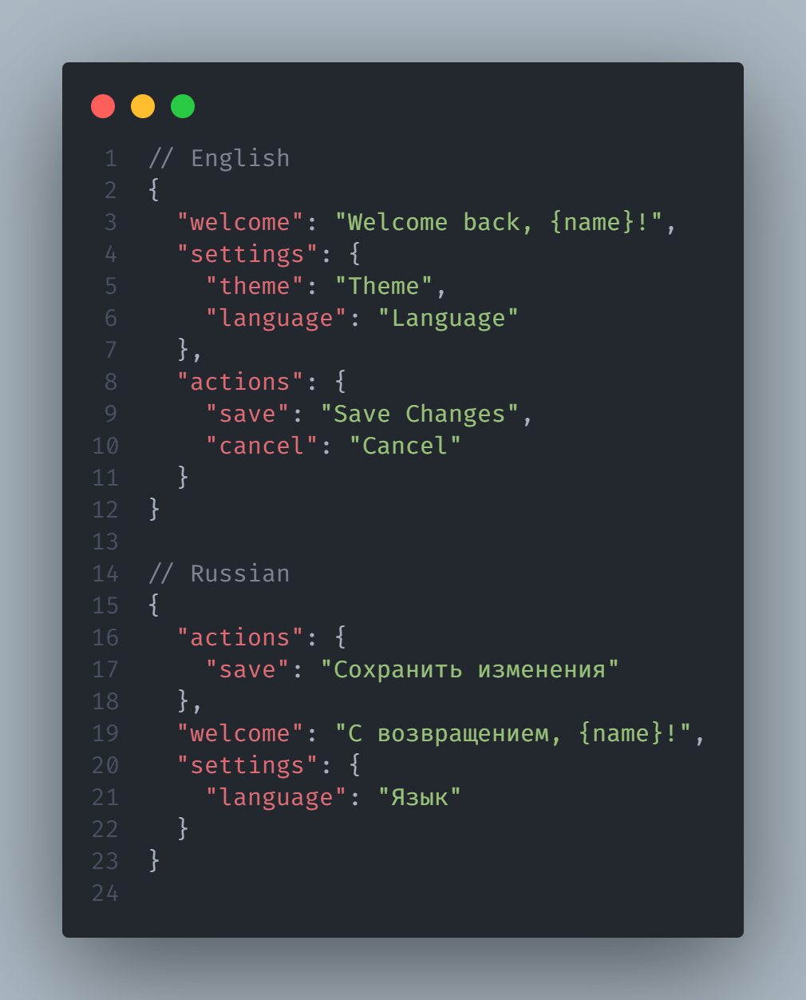

# Polyglot Keeper

🇺🇸 [English](../README.md) | 🇷🇺 [Русский](README.ru.md)

[](https://www.npmjs.com/package/polyglot-keeper)
[](https://www.npmjs.com/package/polyglot-keeper)
[](https://github.com/davidaganov/polyglot-keeper/blob/main/LICENSE)

Инструмент синхронизации i18n на базе ИИ, который автоматически переводит недостающие ключи и поддерживает идеальную структурную согласованность во всех ваших файлах локализации и markdown.

Работает с любым фреймворком (React, Vue, Svelte, Angular) и любой i18n-библиотекой.

|               До                |               После               |
| :-----------------------------: | :-------------------------------: |
|  |  |

## ✨ Возможности

- **Перевод с помощью ИИ** — Переводит недостающие ключи через Gemini, OpenAI или Anthropic.
- **Отслеживание изменений** — Обнаруживает изменения исходных значений и обновляет переводы (`off` / `on` / `carefully`).
- **Зеркалирование структуры** — Поддерживает целевые файлы в полном соответствии со структурой и порядком ключей источника.
- **Очистка** — Автоматически удаляет устаревшие ключи, которых больше нет в основной локали.
- **Надёжная обработка** — Встроенная пакетная обработка с настраиваемыми параметрами повторных попыток и задержек.
- **Интерактивная настройка** — Пошаговый мастер CLI, который поможет начать работу за считанные секунды.

---

## 🚀 Быстрый старт

**1. Установите пакет**

```bash
npm install -D polyglot-keeper
```

**2. Инициализируйте проект**

```bash
npx polyglot-keeper init
```

Эта команда создаёт файлы `polyglot.config.json` и `.env`.

**3. Добавьте API-ключ**

Откройте созданный файл `.env` и добавьте API-ключ вашего провайдера (Gemini, OpenAI или Anthropic).

```
POLYGLOT_API_KEY=ваш_api_ключ
```

**4. Запустите синхронизацию**

```bash
# Синхронизация JSON-локалей
npx polyglot-keeper sync

# Или синхронизация Markdown-файлов
npx polyglot-keeper sync --md
```

---

## ⚙️ Конфигурация

Настройки хранятся в файле `polyglot.config.json`.

<details>
<summary><b>Нажмите, чтобы увидеть полный пример конфигурации</b></summary>

```json
{
  "envFile": ".env",
  "json": {
    "provider": "gemini",
    "model": "gemini-flash-latest",
    "envVarName": "POLYGLOT_API_KEY",
    "localeFormat": "short",
    "locales": ["EN", "RU"],
    "defaultLocale": "EN",
    "localesDir": "src/i18n",
    "trackChanges": "carefully",
    "batchSize": 200,
    "batchDelay": 2000,
    "retryDelay": 35000,
    "maxRetries": 3
  },
  "markdown": {
    "provider": "gemini",
    "model": "gemini-flash-latest",
    "envVarName": "POLYGLOT_MD_API_KEY",
    "contentDir": "content",
    "defaultLocale": "en",
    "locales": ["en", "ru"],
    "trackChanges": "carefully",
    "batchSize": 200,
    "batchDelay": 2000,
    "retryDelay": 35000,
    "maxRetries": 3
  }
}
```

</details>

### Форматы локалей

- `short`: Простые коды локалей (например, `en.json`, `ru.json`)
- `pair`: Формат BCP 47 (например, `en-US.json`, `ru-RU.json`)

### Режимы отслеживания изменений

По умолчанию инструмент переводит только недостающие ключи. Вы можете включить `trackChanges` в конфигурации для обработки изменений в исходных файлах:

- `"off"` — По умолчанию. Переводить только новые ключи, игнорировать изменения существующих значений.
- `"on"` — Автоматически перепереводить все целевые ключи при изменении исходного ключа.
- `"carefully"` — Интерактивный режим. CLI будет запрашивать подтверждение для каждого изменённого ключа: перевести заново, пропустить или заморозить.

> **Примечание:** При включённом отслеживании создаётся файл `.polyglot-lock.json`. Заморозка ключа защищает его от последующих перепереводов (удобно для ручных правок). Используйте `sync --force`, чтобы сбросить замороженные ключи.

---

## 💻 Команды CLI

| Команда                            | Описание                                              |
| :--------------------------------- | :---------------------------------------------------- |
| `npx polyglot-keeper init`         | Запустить интерактивный мастер настройки              |
| `npx polyglot-keeper sync`         | Синхронизировать и перевести JSON-файлы локалей       |
| `npx polyglot-keeper sync --md`    | Синхронизировать и перевести Markdown-файлы           |
| `npx polyglot-keeper sync --force` | Принудительно перевести все существующие ключи заново |

---

## 🛠 Требования

- Node.js 20+
- Действующий API-ключ для Google Gemini, OpenAI или Anthropic

---

## 🤝 Участие в разработке

1. Склонируйте репозиторий и выполните `npm install`
2. Перед отправкой PR запустите проверки качества кода:

```bash
npm run lint
npm run typecheck
npm run test
npm run build
```

---

## 📄 Лицензия

MIT © David Aganov
